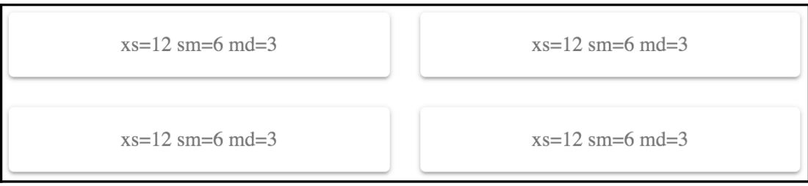

# **Table of Contents**

- [**Table of Contents**](#table-of-contents)
- [**Material-UI Grid**](#material-ui-grid)
  - [**Breakpoints**](#breakpoints)
  - [**Filling Space**](#filling-space)
  - [**Abstracting Containers and Items**](#abstracting-containers-and-items)
  - [**Fixed Column Layout**](#fixed-column-layout)
  - [**Changing Column Direction**](#changing-column-direction)
  - [**Additional Resources**](#additional-resources)

# **Material-UI Grid**

Material-UI grids are used to control the layout of screens in your app. Rather then
implement your own styles to manage the layout of your Material-UI components, you can
leverage the `Grid` component. Behind the scenes, it uses CSS **flexbox** properties to handle
flexible layouts.

## **Breakpoints**

A **breakpoint** is used by Material-UI to determine at what point to break the flow of
content on the screen and continue it on the next line. Understanding how to apply
breakpoints with `Grid` components is fundamental to implementing layouts in Material-UI
applications

Each of the breakpoint properties that you can pass to Grid components correspond to
screen widths, as follows:

- xs >= 0px
- sm >= 600px
- md >= 960px
- lg >= 1280px
- xl >= 1920px

The screen shown previously had a pixel width of 725, which means that the `Grid`
components used the sm breakpoint. The value passed to this property was 6. This can be a
number from 1 to 12 and defines how many items will fit into the grid. This can be
confusing, so it's helpful to think of these numbers in terms of percentages. For example, 6
would be 50% and, as the preceding screenshot shows, the Grid items take up 50% of the
width.

For example, let's say that you want the width of each Grid item to take up 75% of the
screen width when the small breakpoint is active. You could set the sm value to 9 (9/12 =
0.75)

- [Code Example](../material-ui-lesson/src/components/Grid/MUIGrid.js)

You can use the `auto` value for every breakpoint value if you're unsure of which value to
use. I would recommend replacing auto with a value from 1–12 at some point. The auto value
is good enough that you can get started on other things without worrying too much about
layout, but it's far from perfect for your production app. At least by setting up auto this
way, you have all of your Grid components and breakpoint properties in place. You just
need to play with the numbers until everything looks good.

- [Code Example](../material-ui-lesson/src/components/Grid/AutoGrid.js)

## **Filling Space**

With some layouts, it is impossible to have your grid items occupy the entire width of the
screen. Using the justify property, you can control how grid items fill the available space
in the row.

Let's say that you have four Paper components to render in a grid. Inside each of these
Paper components, you have three Chip components, which are nested grid items.

- [Code Example](../material-ui-lesson/src/components/Grid/JustifiedGrid.js)

## **Abstracting Containers and Items**

You have lots of screens in your app, each with lots of `Grid` components, used to create
complex layouts. Trying to read source code that has a ton of `Grid` elements in it can be
daunting. Especially when a `Grid` component is used for both containers and for items.

The container or the item property of Grid components determines the role of the
element. You can create two components that use these properties and create an element
name that's easier to read when you have lots of layout components

- [Code Example](../material-ui-lesson/src/components/Grid/AbstractingContainers.js)

## **Fixed Column Layout**

When you use Grid components to build your layout, they often result in changes to your
layout, depending on your breakpoint settings and the width of the screen. For example, if
the user makes the browser window smaller, your layout might change from two columns
to three. There might be times, however, when you would prefer a fixed number of
columns, and that the width of each column changes in response to the screen size.

Let's say that you have eight Paper components that you want to render, but you also want
to make sure that there are no more than four columns. 

- [Code Example](../material-ui-lesson/src/components/Grid/FixedColumnGrid.js)

If you want a fixed number of columns, you should only specify the xs breakpoint
property. In this example, 3 is 25% of the screen width – or 4 columns. This will never
change because xs is the smallest breakpoint there is. Anything larger is applied to xs as
well, unless you specify a larger breakpoint.

## **Changing Column Direction**

When using a fixed number of columns for your layout, content flows from left to right.
The first grid item goes in the first column, the second item in the second column, and so
on. There could be times when you need better control over which grid items go into which
columns

Let's say that you have a four-column layout, but you want the first and second items to go
in the first column, the third and fourth items in the second, and so on. This involves using
nested Grid containers, and changing the direction property, as follows:

- [Code Example](../material-ui-lesson/src/components/Grid/ChangingColumnDirections.js)

You might have noticed that the font looks different, compared to other
examples in this chapter. This is because of the `Typography` component
used to style the text and apply Material-UI theme styles. Most MaterialUI
components that display text don't require you to use `Typography`, but
`Paper` does

There might be times when hiding the rightmost column makes more sense than trying to
accommodate it with the screen width. You can use the Hidden component for this. It's
already imported in the example, as follows:
`import Hidden from '@material-ui/core/Hidden';`
To use it, you wrap the last column with it

## **Additional Resources**

- [`Grid` API documentation](https://material-ui.com/api/grid/)
- [`Grid` Demos](https://material-ui.com/layout/grid/)
- [`Breakpoint`](https://material-ui.com/layout/breakpoints/)
- [`Hidden` API Documentation](https://material-ui.com/api/hidden/)